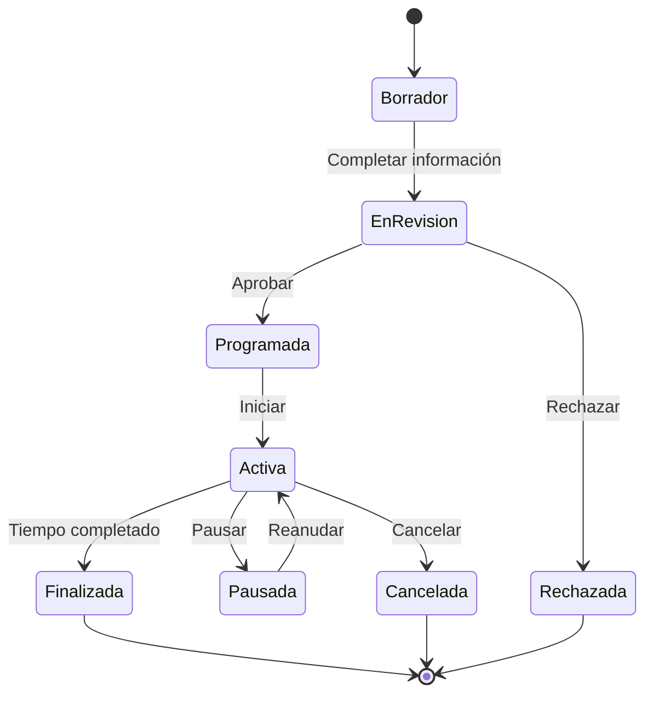

# 🔨 Estados de Subasta

## 📊 Diagrama Principal



## 🔄 Estados y Transiciones

### 📝 Borrador
- **Entrada**: Creación inicial de subasta
- **Validaciones**:
  - Información básica completa
  - Al menos 3 imágenes
  - Precio inicial válido
  - Categoría seleccionada
- **Salidas**:
  - → EnRevision (cuando completo)
  - → Descartado (inactivo 7 días)

### 👀 EnRevision
- **Entrada**: Subasta completa lista para revisión
- **Validaciones**:
  - Moderación de contenido
  - Verificación de producto
  - Validación de precios
  - Check de restricciones
- **Salidas**:
  - → Programada (aprobada)
  - → Rechazada (no cumple requisitos)

### 📅 Programada
- **Entrada**: Subasta aprobada esperando inicio
- **Validaciones**:
  - Fecha inicio válida
  - Vendedor activo
  - Producto disponible
  - Configuración correcta
- **Salidas**:
  - → Activa (fecha inicio)
  - → Cancelada (vendedor cancela)

### ⚡ Activa
- **Entrada**: Subasta en curso
- **Validaciones**:
  - Pujas válidas
  - Tiempo restante
  - Estado del vendedor
  - Disponibilidad producto
- **Salidas**:
  - → Pausada (problema temporal)
  - → Finalizada (tiempo completo)
  - → Cancelada (problema grave)

### ⏸️ Pausada
- **Entrada**: Suspensión temporal
- **Validaciones**:
  - Razón válida
  - Tiempo máximo pausa
  - Autorización admin
  - Notificación participantes
- **Salidas**:
  - → Activa (problema resuelto)
  - → Cancelada (no resoluble)

### ✅ Finalizada
- **Entrada**: Subasta completada
- **Validaciones**:
  - Ganador válido
  - Pago procesable
  - Documentación completa
  - Estado envío
- **Acciones**:
  - Notificar ganador
  - Procesar pago
  - Iniciar envío
  - Actualizar inventario

### ❌ Cancelada
- **Entrada**: Subasta terminada prematuramente
- **Validaciones**:
  - Razón válida
  - Estado de pujas
  - Depósitos activos
  - Penalizaciones
- **Acciones**:
  - Devolver depósitos
  - Notificar participantes
  - Aplicar penalizaciones
  - Registrar motivo

### 🚫 Rechazada
- **Entrada**: No cumple requisitos
- **Validaciones**:
  - Motivo rechazo
  - Feedback detallado
  - Opciones corrección
- **Acciones**:
  - Notificar vendedor
  - Registrar razones
  - Sugerir mejoras

## 🎯 Acciones por Estado

### Permitidas por Estado
```typescript
interface AuctionStateActions {
    Borrador: [
        'editar',
        'enviarRevision',
        'descartar'
    ];
    
    EnRevision: [
        'aprobar',
        'rechazar',
        'solicitarCambios'
    ];
    
    Programada: [
        'activar',
        'reprogramar',
        'cancelar'
    ];
    
    Activa: [
        'recibirPuja',
        'pausar',
        'finalizar',
        'cancelar'
    ];
    
    Pausada: [
        'reanudar',
        'extender',
        'cancelar'
    ];
    
    Finalizada: [
        'procesarPago',
        'iniciarEnvio',
        'reportarProblema'
    ];
}
```

## ⏱️ Timeouts y Límites

### Por Estado
```typescript
interface StateTimeouts {
    Borrador: '7 días';
    EnRevision: '24 horas';
    Programada: '30 días';
    Activa: '1-30 días';
    Pausada: '24 horas';
    Finalizada: '48 horas para pago';
}
```

## 📱 Notificaciones

### Eventos Notificables
```typescript
interface StateNotifications {
    Borrador: [
        'recordatorioCompletar',
        'avisoExpiración'
    ];
    
    EnRevision: [
        'inicioRevisión',
        'resultadoRevisión'
    ];
    
    Programada: [
        'confirmacionFecha',
        'recordatorioInicio'
    ];
    
    Activa: [
        'nuevaPuja',
        'superadoPuja',
        'proximoFin'
    ];
    
    Pausada: [
        'inicioPausa',
        'actualizaciónEstado',
        'finPausa'
    ];
    
    Finalizada: [
        'ganador',
        'recordatorioPago',
        'confirmacionEnvio'
    ];
}
```

## 🔍 Queries Comunes

### Por Estado
```typescript
interface StateQueries {
    Borrador: [
        'incompletasPorTiempo',
        'proximasExpirar'
    ];
    
    EnRevision: [
        'pendientesRevision',
        'tiempoPromedio'
    ];
    
    Programada: [
        'inicioProximo24h',
        'porFechaInicio'
    ];
    
    Activa: [
        'masActivas',
        'finalizanHoy',
        'sinPujas'
    ];
    
    Finalizada: [
        'pendientesPago',
        'pendientesEnvio',
        'completadas'
    ];
}
```
