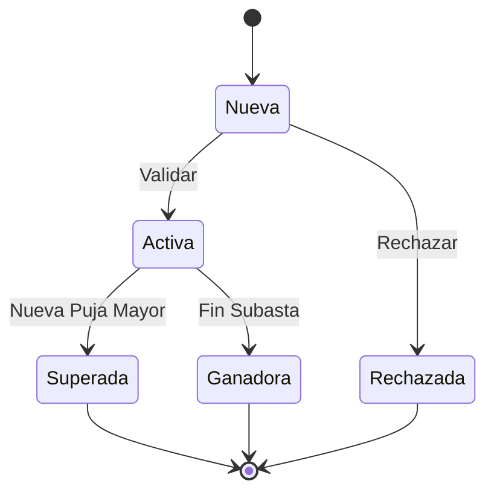

# 💰 Estados de Puja

## 📊 Diagrama Principal



## 🔄 Estados y Transiciones

### 📝 Nueva
- **Entrada**: Puja realizada
- **Validaciones**:
  - Monto válido
  - Usuario elegible
  - Fondos disponibles
  - Tiempo válido
- **Salidas**:
  - → Activa (validada)
  - → Rechazada (no válida)

### ✅ Activa
- **Entrada**: Puja validada
- **Validaciones**:
  - Subasta activa
  - Mejor puja actual
  - Depósito bloqueado
  - Usuario activo
- **Salidas**:
  - → Superada (nueva puja mayor)
  - → Ganadora (fin subasta)

### 🏆 Ganadora
- **Entrada**: Subasta finalizada
- **Validaciones**:
  - Subasta completada
  - Pago pendiente
  - Usuario válido
  - Documentación
- **Acciones**:
  - Notificar ganador
  - Iniciar pago
  - Actualizar subasta
  - Generar documentos

### 📉 Superada
- **Entrada**: Nueva puja mayor
- **Validaciones**:
  - Nueva puja válida
  - Diferencia mínima
  - Notificaciones
  - Depósitos
- **Acciones**:
  - Liberar depósito
  - Notificar usuario
  - Actualizar historial
  - Ofrecer contrapuja

### ❌ Rechazada
- **Entrada**: Validación fallida
- **Validaciones**:
  - Razón rechazo
  - Notificación
  - Registro
- **Acciones**:
  - Notificar usuario
  - Registrar razón
  - Liberar fondos
  - Sugerir corrección

## 🎯 Acciones por Estado

### Permitidas por Estado
```typescript
interface BidStateActions {
    Nueva: [
        'validar',
        'calcularIncremento',
        'verificarFondos',
        'rechazar'
    ];
    
    Activa: [
        'monitorear',
        'notificarEstado',
        'procesarNuevaPuja',
        'finalizar'
    ];
    
    Ganadora: [
        'iniciarPago',
        'generarDocumentos',
        'notificarPartes',
        'cerrarSubasta'
    ];
    
    Superada: [
        'liberarDeposito',
        'actualizarHistorial',
        'notificarUsuario',
        'sugerirContrapuja'
    ];
}
```

## ⏱️ Timeouts y Límites

### Por Estado
```typescript
interface StateTimeouts {
    Nueva: '30 segundos';
    Activa: 'hasta fin subasta';
    Ganadora: '48 horas para pago';
    Superada: '24 horas retención';
}
```

## 💰 Reglas Financieras

### Por Estado
```typescript
interface BidFinancialRules {
    Nueva: {
        depositoRequerido: true,
        montoMinimo: 'última puja + incremento',
        fondosVerificados: true
    };
    
    Activa: {
        depositoBloqueado: true,
        incrementoRespetado: true,
        limitesUsuario: true
    };
    
    Ganadora: {
        pagoRequerido: true,
        tiempoLimitePago: '48h',
        comisionesAplicables: true
    };
}
```

## 📱 Notificaciones

### Eventos Notificables
```typescript
interface StateNotifications {
    Nueva: [
        'pujaRecibida',
        'validacionIniciada',
        'resultadoValidacion'
    ];
    
    Activa: [
        'pujaAceptada',
        'estadoSubasta',
        'proximaFinalizacion'
    ];
    
    Ganadora: [
        'felicitaciones',
        'instruccionesPago',
        'recordatorios'
    ];
    
    Superada: [
        'nuevaPujaMayor',
        'devolucionDeposito',
        'sugerenciasAccion'
    ];
}
```

## 📊 Métricas y KPIs

### Por Estado
```typescript
interface StateMetrics {
    performance: {
        tiempoValidacion: number;
        tasaConversion: number;
        pujaPromedio: number;
        incrementoPromedio: number;
    };
    
    financieros: {
        depositosBloqueados: number;
        pujasGanadoras: number;
        valorTotal: number;
        comisionesGeneradas: number;
    };
    
    usuario: {
        participacionSubasta: number;
        tasaExito: number;
        tiempoRespuesta: number;
        satisfaccion: number;
    };
}
```

## 🔍 Queries Comunes

### Por Estado
```typescript
interface StateQueries {
    Nueva: [
        'pendientesValidacion',
        'distribucionMontos',
        'tasaRechazo'
    ];
    
    Activa: [
        'pujasActivas',
        'rankingUsuarios',
        'tendenciasPrecios'
    ];
    
    Ganadora: [
        'pendientesPago',
        'valorPromedio',
        'tiemposCierre'
    ];
    
    Superada: [
        'historicoIncrementos',
        'comportamientoUsuarios',
        'patronesCompetencia'
    ];
}
```
