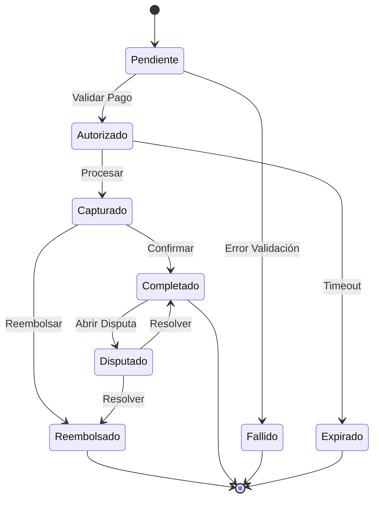

# 💳 Estados de Pago

## 📊 Diagrama Principal



## 🔄 Estados y Transiciones

### 📝 Pendiente
- **Entrada**: Inicio de pago
- **Validaciones**:
  - Fondos disponibles
  - Método pago válido
  - Límites usuario
  - Riesgo transacción
- **Salidas**:
  - → Autorizado (validación OK)
  - → Fallido (error validación)

### ✅ Autorizado
- **Entrada**: Pago validado
- **Validaciones**:
  - Autorización banco
  - Fondos bloqueados
  - Tiempo válido
  - Fraude check
- **Salidas**:
  - → Capturado (procesamiento OK)
  - → Expirado (timeout)

### 💫 Capturado
- **Entrada**: Pago procesado
- **Validaciones**:
  - Captura exitosa
  - Fondos transferidos
  - Documentación completa
  - Notificaciones enviadas
- **Salidas**:
  - → Completado (confirmación final)
  - → Reembolsado (cancelación)

### ⭐ Completado
- **Entrada**: Pago finalizado
- **Validaciones**:
  - Fondos recibidos
  - Documentos generados
  - Notificaciones enviadas
  - Registro actualizado
- **Salidas**:
  - → Disputado (reclamo)

### ⚠️ Disputado
- **Entrada**: Reclamo recibido
- **Validaciones**:
  - Motivo válido
  - Tiempo límite
  - Evidencia
  - Estado transacción
- **Salidas**:
  - → Completado (resuelto a favor vendedor)
  - → Reembolsado (resuelto a favor comprador)

### 🔄 Reembolsado
- **Entrada**: Devolución iniciada
- **Validaciones**:
  - Motivo válido
  - Fondos disponibles
  - Método original
  - Documentación
- **Acciones**:
  - Devolver fondos
  - Actualizar registros
  - Notificar partes
  - Cerrar caso

### ❌ Fallido
- **Entrada**: Error en proceso
- **Validaciones**:
  - Tipo error
  - Intentos realizados
  - Notificación
  - Registro
- **Acciones**:
  - Notificar error
  - Sugerir alternativas
  - Registrar causa
  - Liberar recursos

### ⏰ Expirado
- **Entrada**: Timeout alcanzado
- **Validaciones**:
  - Tiempo transcurrido
  - Estado recursos
  - Notificaciones
- **Acciones**:
  - Liberar fondos
  - Notificar partes
  - Cerrar proceso
  - Registrar timeout

## 🎯 Acciones por Estado

### Permitidas por Estado
```typescript
interface PaymentStateActions {
    Pendiente: [
        'validar',
        'cancelar',
        'reintentar'
    ];
    
    Autorizado: [
        'capturar',
        'cancelar',
        'extenderTiempo'
    ];
    
    Capturado: [
        'confirmar',
        'reembolsar',
        'documentar'
    ];
    
    Completado: [
        'disputar',
        'exportar',
        'archivar'
    ];
    
    Disputado: [
        'resolverDisputa',
        'solicitarEvidencia',
        'mediar'
    ];
}
```

## ⏱️ Timeouts y Límites

### Por Estado
```typescript
interface StateTimeouts {
    Pendiente: '15 minutos';
    Autorizado: '24 horas';
    Capturado: '48 horas';
    Disputado: '15 días';
    Reembolso: '5-10 días hábiles';
}
```

## 💰 Reglas Financieras

### Por Estado
```typescript
interface StateFinancialRules {
    Pendiente: {
        bloqueoFondos: true,
        comisiones: 'calculadas',
        limites: 'verificados'
    };
    
    Autorizado: {
        fondosReservados: true,
        procesamiento: 'iniciado',
        garantias: 'activas'
    };
    
    Capturado: {
        fondosTransferidos: true,
        comisionesCobradas: true,
        documentosFiscales: 'generados'
    };
    
    Completado: {
        liquidacionFinal: true,
        reportesGenerados: true,
        archivado: false
    };
}
```

## 📱 Notificaciones

### Eventos Notificables
```typescript
interface StateNotifications {
    Pendiente: [
        'inicioPago',
        'recordatorioPago',
        'errorValidacion'
    ];
    
    Autorizado: [
        'pagoAutorizado',
        'procesando',
        'proximoExpirar'
    ];
    
    Capturado: [
        'pagoCapturado',
        'detallesTransaccion',
        'instruccionesSiguientes'
    ];
    
    Completado: [
        'confirmacionPago',
        'resumenTransaccion',
        'documentacionDisponible'
    ];
    
    Disputado: [
        'aperturaDisputa',
        'solicitudEvidencia',
        'actualizacionEstado'
    ];
}
```

## 📊 Métricas y KPIs

### Por Estado
```typescript
interface StateMetrics {
    tasaExito: {
        autorizacion: number;
        captura: number;
        completion: number;
    };
    
    tiempoPromedio: {
        autorizacion: number;
        procesamiento: number;
        disputa: number;
    };
    
    costos: {
        procesamiento: number;
        disputas: number;
        reembolsos: number;
    };
}
```

## 🔍 Queries Comunes

### Por Estado
```typescript
interface StateQueries {
    Pendiente: [
        'pagosEnProceso',
        'tiemposEspera',
        'tasaAbandono'
    ];
    
    Autorizado: [
        'pendientesCaptura',
        'proximosExpirar',
        'autorizacionesFallidas'
    ];
    
    Completado: [
        'ultimasTransacciones',
        'volumenesDiarios',
        'distribucionMetodos'
    ];
    
    Disputado: [
        'disputasActivas',
        'tiemposResolucion',
        'tasaExito'
    ];
}
```
