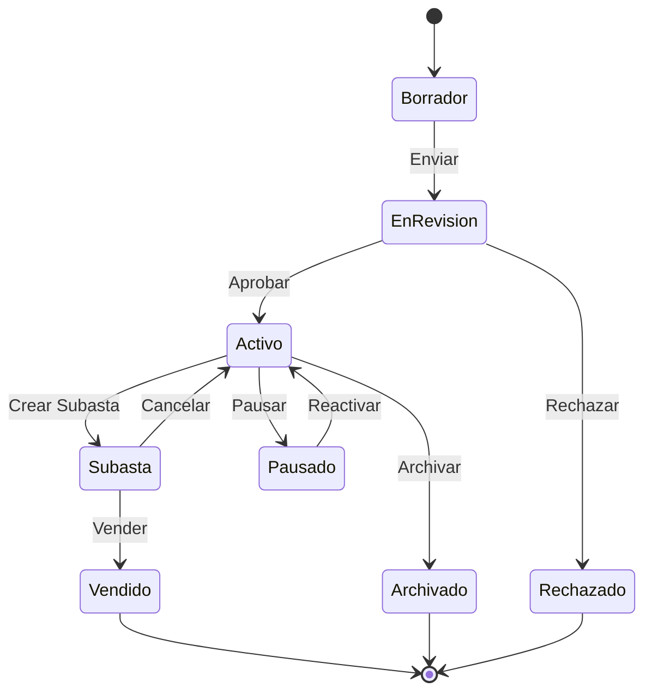

# 📦 Estados de Producto

## 📊 Diagrama Principal



## 🔄 Estados y Transiciones

### 📝 Borrador
- **Entrada**: Creación inicial
- **Validaciones**:
  - Info básica completa
  - Imágenes requeridas
  - Categoría válida
  - Precio establecido
- **Salidas**:
  - → EnRevision (completo)
  - → Descartado (inactivo)

### 👀 EnRevision
- **Entrada**: Producto completo
- **Validaciones**:
  - Contenido apropiado
  - Calidad imágenes
  - Precio razonable
  - Categorización correcta
- **Salidas**:
  - → Activo (aprobado)
  - → Rechazado (no cumple)

### ✅ Activo
- **Entrada**: Producto aprobado
- **Validaciones**:
  - Disponibilidad
  - Estado vendedor
  - Restricciones
  - Visibilidad
- **Salidas**:
  - → Subasta (crear subasta)
  - → Pausado (pausar)
  - → Archivado (archivar)

### 🔨 Subasta
- **Entrada**: Subasta creada
- **Validaciones**:
  - Configuración subasta
  - Disponibilidad
  - Estado vendedor
  - Depósitos
- **Salidas**:
  - → Vendido (venta exitosa)
  - → Activo (cancelar)

### ⏸️ Pausado
- **Entrada**: Temporalmente inactivo
- **Validaciones**:
  - Razón válida
  - Duración pausa
  - Estado vendedor
  - Notificaciones
- **Salidas**:
  - → Activo (reactivar)
  - → Archivado (expirado)

### 💰 Vendido
- **Entrada**: Venta completada
- **Validaciones**:
  - Pago confirmado
  - Envío iniciado
  - Documentación
  - Garantías
- **Acciones**:
  - Actualizar inventario
  - Procesar comisiones
  - Generar documentos
  - Cerrar listado

### 📁 Archivado
- **Entrada**: Producto retirado
- **Validaciones**:
  - Razón archivo
  - Estado transacciones
  - Documentación
  - Historial
- **Acciones**:
  - Remover listados
  - Actualizar índices
  - Mantener historial
  - Notificar relevantes

## 🎯 Acciones por Estado

### Permitidas por Estado
```typescript
interface ProductStateActions {
    Borrador: [
        'editar',
        'completar',
        'enviarRevision',
        'descartar'
    ];
    
    EnRevision: [
        'aprobar',
        'rechazar',
        'solicitarCambios',
        'verificarDetalles'
    ];
    
    Activo: [
        'crearSubasta',
        'pausar',
        'actualizar',
        'archivar'
    ];
    
    Subasta: [
        'monitorear',
        'modificar',
        'cancelar',
        'finalizar'
    ];
    
    Pausado: [
        'reactivar',
        'extenderPausa',
        'archivar',
        'actualizar'
    ];
}
```

## ⏱️ Timeouts y Límites

### Por Estado
```typescript
interface StateTimeouts {
    Borrador: '7 días';
    EnRevision: '24 horas';
    Activo: '90 días';
    Subasta: '1-30 días';
    Pausado: '30 días';
}
```

## 📱 Notificaciones

### Eventos Notificables
```typescript
interface StateNotifications {
    Borrador: [
        'recordatorioCompletar',
        'sugerenciasMejora',
        'proximoExpirar'
    ];
    
    EnRevision: [
        'inicioRevision',
        'resultadoRevision',
        'cambiosRequeridos'
    ];
    
    Activo: [
        'listadoActivo',
        'visitasRecibidas',
        'interesGenerado'
    ];
    
    Subasta: [
        'pujaRecibida',
        'estadoSubasta',
        'finalizacionProxima'
    ];
    
    Pausado: [
        'confirmacionPausa',
        'recordatorioReactivar',
        'proximoExpirar'
    ];
}
```

## 📊 Métricas y KPIs

### Por Estado
```typescript
interface StateMetrics {
    visibilidad: {
        vistas: number;
        clicks: number;
        conversion: number;
        engagement: number;
    };
    
    calidad: {
        completitud: number;
        precisión: number;
        relevancia: number;
        satisfacción: number;
    };
    
    rendimiento: {
        tiempoVenta: number;
        precioFinal: number;
        margenBeneficio: number;
        tasaÉxito: number;
    };
}
```

## 🔍 Queries Comunes

### Por Estado
```typescript
interface StateQueries {
    Borrador: [
        'incompletosRecientes',
        'proximosExpirar',
        'porCategoria'
    ];
    
    EnRevision: [
        'pendientesRevision',
        'tiempoPromedio',
        'tasaAprobacion'
    ];
    
    Activo: [
        'masVistos',
        'mejorValorados',
        'recomendados'
    ];
    
    Subasta: [
        'subastaActiva',
        'masPopulares',
        'finalizanHoy'
    ];
    
    Pausado: [
        'pausaProximaExpirar',
        'razonesComunes',
        'tiempoPromedioPausa'
    ];
}
```
