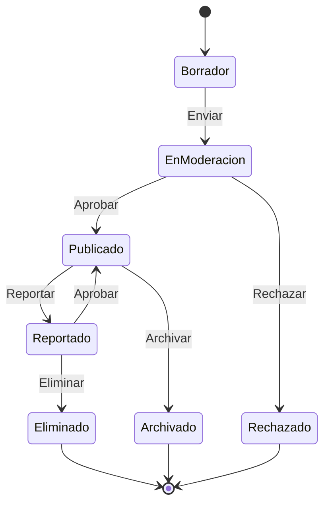

# ⭐ Estados de Valoraciones y Comentarios

## 📊 Diagrama Principal



## 🔄 Estados y Transiciones

### 📝 Borrador
- **Entrada**: Creación inicial
- **Validaciones**:
  - Longitud válida
  - Contenido básico
  - Usuario elegible
  - Transacción válida
- **Salidas**:
  - → EnModeracion (enviar)
  - → Descartado (abandonar)

### 👀 EnModeracion
- **Entrada**: Contenido enviado
- **Validaciones**:
  - Contenido apropiado
  - Sin spam
  - Relevante
  - Completo
- **Salidas**:
  - → Publicado (aprobar)
  - → Rechazado (no cumple)

### ✅ Publicado
- **Entrada**: Contenido aprobado
- **Validaciones**:
  - Visibilidad
  - Notificaciones
  - Respuestas permitidas
  - Métricas activas
- **Salidas**:
  - → Reportado (reporte)
  - → Archivado (tiempo)

### ⚠️ Reportado
- **Entrada**: Reporte recibido
- **Validaciones**:
  - Motivo válido
  - Evidencia
  - Historial usuario
  - Gravedad
- **Salidas**:
  - → Publicado (aprobar)
  - → Eliminado (confirmar)

### 🗑️ Eliminado
- **Entrada**: Contenido removido
- **Validaciones**:
  - Razón eliminación
  - Notificaciones
  - Registro
  - Penalizaciones
- **Acciones**:
  - Notificar autor
  - Actualizar métricas
  - Registrar motivo
  - Aplicar sanciones

### 📁 Archivado
- **Entrada**: Contenido antiguo
- **Validaciones**:
  - Tiempo activo
  - Actividad reciente
  - Relevancia
  - Estado relacionados
- **Acciones**:
  - Reducir visibilidad
  - Mantener historial
  - Actualizar índices
  - Preservar datos

## 🎯 Acciones por Estado

### Permitidas por Estado
```typescript
interface RatingCommentStateActions {
    Borrador: [
        'editar',
        'enviar',
        'previsualizar',
        'descartar'
    ];
    
    EnModeracion: [
        'revisar',
        'aprobar',
        'rechazar',
        'solicitarCambios'
    ];
    
    Publicado: [
        'responder',
        'reportar',
        'editar',
        'archivar'
    ];
    
    Reportado: [
        'investigar',
        'aprobar',
        'eliminar',
        'advertir'
    ];
}
```

## ⏱️ Timeouts y Límites

### Por Estado
```typescript
interface StateTimeouts {
    Borrador: '24 horas';
    EnModeracion: '48 horas';
    Publicado: '365 días';
    Reportado: '72 horas';
}
```

## 🌟 Reglas de Valoración

### Por Tipo
```typescript
interface RatingRules {
    Producto: {
        minScore: 1,
        maxScore: 5,
        requiereComentario: true,
        categorias: [
            'calidad',
            'precisión',
            'valor'
        ]
    };
    
    Vendedor: {
        minScore: 1,
        maxScore: 5,
        requiereComentario: false,
        categorias: [
            'comunicación',
            'envío',
            'servicio'
        ]
    };
    
    Comprador: {
        minScore: 1,
        maxScore: 5,
        requiereComentario: false,
        categorias: [
            'pago',
            'comunicación',
            'fiabilidad'
        ]
    };
}
```

## 📱 Notificaciones

### Eventos Notificables
```typescript
interface StateNotifications {
    Borrador: [
        'recordatorioCompletar',
        'sugerenciasMejora',
        'proximoExpirar'
    ];
    
    EnModeracion: [
        'recibido',
        'enRevision',
        'resultado'
    ];
    
    Publicado: [
        'confirmacion',
        'respuestas',
        'reacciones'
    ];
    
    Reportado: [
        'notificacionReporte',
        'actualizacionEstado',
        'resolucion'
    ];
}
```

## 📊 Métricas y KPIs

### Por Estado
```typescript
interface StateMetrics {
    engagement: {
        vistas: number;
        respuestas: number;
        utilidad: number;
        compartidos: number;
    };
    
    calidad: {
        longitudPromedio: number;
        sentimiento: number;
        relevancia: number;
        precisión: number;
    };
    
    moderacion: {
        tiempoRevision: number;
        tasaAprobacion: number;
        reportes: number;
        resolución: number;
    };
}
```

## 🔍 Queries Comunes

### Por Estado
```typescript
interface StateQueries {
    Borrador: [
        'pendientesEnvio',
        'porExpirar',
        'porUsuario'
    ];
    
    EnModeracion: [
        'colaModeracion',
        'tiemposRevision',
        'distribucionResultados'
    ];
    
    Publicado: [
        'masUtiles',
        'masRecientes',
        'mejorValorados'
    ];
    
    Reportado: [
        'reportesActivos',
        'porTipoReporte',
        'tiempoResolucion'
    ];
}
```
