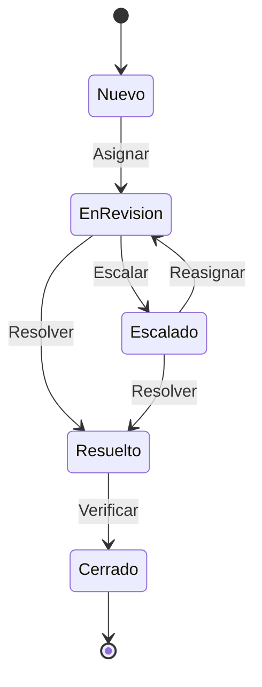

# 🚫 Estados de Reporte

## 📊 Diagrama Principal



## 🔄 Estados y Transiciones

### 📝 Nuevo
- **Entrada**: Reporte creado
- **Validaciones**:
  - Tipo válido
  - Evidencia suficiente
  - Usuario reportante
  - Elemento reportado
- **Salidas**:
  - → EnRevision (asignado)
  - → Cerrado (automático)

### 👀 EnRevision
- **Entrada**: Asignado a moderador
- **Validaciones**:
  - Moderador disponible
  - Prioridad correcta
  - Tiempo respuesta
  - Historial relacionado
- **Salidas**:
  - → Escalado (complejidad)
  - → Resuelto (decisión)

### ⚠️ Escalado
- **Entrada**: Requiere atención especial
- **Validaciones**:
  - Razón escalado
  - Nivel requerido
  - Documentación
  - Urgencia
- **Salidas**:
  - → EnRevision (reasignado)
  - → Resuelto (decisión final)

### ✅ Resuelto
- **Entrada**: Decisión tomada
- **Validaciones**:
  - Acción realizada
  - Documentación completa
  - Notificaciones enviadas
  - Seguimiento necesario
- **Salidas**:
  - → Cerrado (verificado)

### 📁 Cerrado
- **Entrada**: Resolución verificada
- **Validaciones**:
  - Satisfacción usuario
  - Documentación final
  - Métricas actualizadas
  - Caso archivado
- **Acciones**:
  - Actualizar estadísticas
  - Archivar caso
  - Notificar final
  - Registrar aprendizajes

## 🎯 Acciones por Estado

### Permitidas por Estado
```typescript
interface ReportStateActions {
    Nuevo: [
        'validar',
        'categorizar',
        'asignar',
        'priorizar'
    ];
    
    EnRevision: [
        'investigar',
        'contactarPartes',
        'tomarAccion',
        'escalar'
    ];
    
    Escalado: [
        'revisarPorExperto',
        'consultarLegal',
        'documentar',
        'resolver'
    ];
    
    Resuelto: [
        'verificarAccion',
        'notificarPartes',
        'actualizarRegistros',
        'cerrar'
    ];
}
```

## ⏱️ Timeouts y Límites

### Por Estado
```typescript
interface StateTimeouts {
    Nuevo: '24 horas';
    EnRevision: '48 horas';
    Escalado: '72 horas';
    Resuelto: '24 horas';
}
```

## 🚨 Reglas de Moderación

### Por Tipo
```typescript
interface ModerationRules {
    Spam: {
        autoResolución: true,
        tiempoRespuesta: '24h',
        accionesAutomáticas: [
            'eliminarContenido',
            'advertirUsuario'
        ]
    };
    
    Fraude: {
        requiereEscalado: true,
        evidenciaRequerida: true,
        accionesDisponibles: [
            'suspenderCuenta',
            'bloquearTransacciones'
        ]
    };
    
    Contenido: {
        revisiónManual: true,
        guíasAplicables: [
            'políticaContenido',
            'estándaresComunidad'
        ]
    };
}
```

## 📱 Notificaciones

### Eventos Notificables
```typescript
interface StateNotifications {
    Nuevo: [
        'reporteRecibido',
        'asignacionPendiente',
        'confirmacionRecepcion'
    ];
    
    EnRevision: [
        'inicioRevision',
        'solicitudInformacion',
        'actualizacionEstado'
    ];
    
    Escalado: [
        'notificacionEscalado',
        'solicitudExperto',
        'tiemposRespuesta'
    ];
    
    Resuelto: [
        'decisionTomada',
        'accionesRealizadas',
        'retroalimentacion'
    ];
}
```

## 📊 Métricas y KPIs

### Por Estado
```typescript
interface StateMetrics {
    tiempos: {
        asignacion: number;
        primeraRespuesta: number;
        resolucion: number;
        cierre: number;
    };
    
    calidad: {
        satisfaccionUsuario: number;
        precision: number;
        consistencia: number;
        efectividad: number;
    };
    
    volumen: {
        reportesDiarios: number;
        escaladasPorcentaje: number;
        resolucionAutomatica: number;
        reapertura: number;
    };
}
```

## 🔍 Queries Comunes

### Por Estado
```typescript
interface StateQueries {
    Nuevo: [
        'sinAsignar',
        'porPrioridad',
        'porCategoria'
    ];
    
    EnRevision: [
        'asignadosHoy',
        'proximosVencer',
        'porModerador'
    ];
    
    Escalado: [
        'tiempoEscalados',
        'porNivel',
        'pendientesExperto'
    ];
    
    Resuelto: [
        'resolucionesHoy',
        'tiempoPromedio',
        'satisfaccionUsuario'
    ];
}
```
