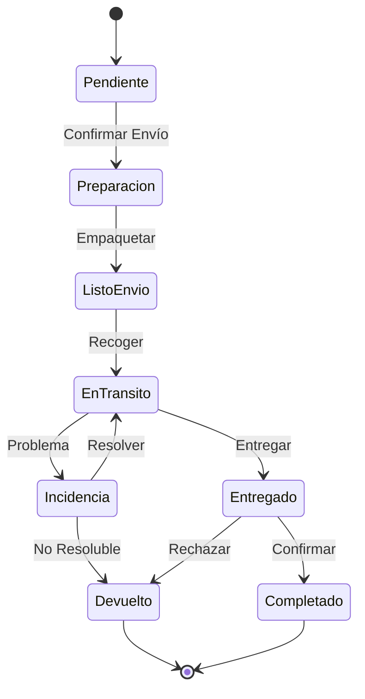

# 📦 Estados de Envío

## 📊 Diagrama Principal



## 🔄 Estados y Transiciones

### 📝 Pendiente
- **Entrada**: Pago confirmado
- **Validaciones**:
  - Dirección válida
  - Stock disponible
  - Restricciones envío
  - Documentación
- **Salidas**:
  - → Preparación (confirmado)
  - → Cancelado (error)

### 📦 Preparación
- **Entrada**: Envío confirmado
- **Validaciones**:
  - Empaque correcto
  - Etiquetas generadas
  - Documentos listos
  - Peso/dimensiones
- **Salidas**:
  - → ListoEnvio (empaquetado)
  - → Incidencia (problema)

### ✅ ListoEnvio
- **Entrada**: Paquete preparado
- **Validaciones**:
  - Etiquetas correctas
  - Documentación completa
  - Recogida programada
  - Seguro validado
- **Salidas**:
  - → EnTransito (recogido)
  - → Incidencia (problema)

### 🚚 EnTransito
- **Entrada**: Paquete recogido
- **Validaciones**:
  - Tracking activo
  - Ruta válida
  - Tiempos estimados
  - Estado paquete
- **Salidas**:
  - → Entregado (entrega OK)
  - → Incidencia (problema)

### 📬 Entregado
- **Entrada**: Entrega realizada
- **Validaciones**:
  - Confirmación recepción
  - Estado paquete
  - Documentación firmada
  - Fotos entrega
- **Salidas**:
  - → Completado (aceptado)
  - → Devuelto (rechazado)

### ⚠️ Incidencia
- **Entrada**: Problema detectado
- **Validaciones**:
  - Tipo problema
  - Solución posible
  - Tiempo estimado
  - Responsabilidad
- **Salidas**:
  - → EnTransito (resuelto)
  - → Devuelto (no resoluble)

### ↩️ Devuelto
- **Entrada**: Devolución iniciada
- **Validaciones**:
  - Motivo válido
  - Estado producto
  - Documentación
  - Costos
- **Acciones**:
  - Procesar devolución
  - Actualizar inventario
  - Gestionar reembolso
  - Cerrar envío

### ✨ Completado
- **Entrada**: Entrega confirmada
- **Validaciones**:
  - Satisfacción cliente
  - Documentación completa
  - Pagos finalizados
  - Garantías activas
- **Acciones**:
  - Cerrar envío
  - Actualizar métricas
  - Archivar documentos
  - Solicitar review

## 🎯 Acciones por Estado

### Permitidas por Estado
```typescript
interface ShippingStateActions {
    Pendiente: [
        'confirmarEnvio',
        'validarDireccion',
        'calcularCostos'
    ];
    
    Preparacion: [
        'generarEtiquetas',
        'empaquetar',
        'programarRecogida'
    ];
    
    ListoEnvio: [
        'confirmarRecogida',
        'actualizarEstado',
        'modificarFecha'
    ];
    
    EnTransito: [
        'actualizarTracking',
        'reportarIncidencia',
        'estimarLlegada'
    ];
    
    Entregado: [
        'confirmarRecepcion',
        'reportarProblema',
        'solicitarFirma'
    ];
}
```

## ⏱️ Timeouts y Límites

### Por Estado
```typescript
interface StateTimeouts {
    Pendiente: '24 horas';
    Preparacion: '48 horas';
    ListoEnvio: '24 horas';
    EnTransito: 'según destino';
    Entregado: '48 horas';
    Incidencia: '72 horas';
}
```

## 📦 Reglas Logísticas

### Por Estado
```typescript
interface StateLogistics {
    Preparacion: {
        pesoMaximo: number;
        dimensionesMax: {
            largo: number;
            ancho: number;
            alto: number;
        };
        empaquePrioritario: boolean;
    };
    
    EnTransito: {
        rutaOptimizada: boolean;
        seguimientoActivo: boolean;
        alertasActivadas: boolean;
    };
    
    Entregado: {
        confirmacionRequerida: boolean;
        fotoEntrega: boolean;
        firmaDigital: boolean;
    };
}
```

## 📱 Notificaciones

### Eventos Notificables
```typescript
interface StateNotifications {
    Pendiente: [
        'confirmacionEnvio',
        'instruccionesPreparacion',
        'recordatorios'
    ];
    
    EnTransito: [
        'actualizacionEstado',
        'estimacionEntrega',
        'incidencias'
    ];
    
    Entregado: [
        'confirmacionEntrega',
        'solicitudFeedback',
        'garantiaProducto'
    ];
    
    Incidencia: [
        'notificacionProblema',
        'actualizacionEstado',
        'resolucion'
    ];
}
```

## 📊 Métricas y KPIs

### Por Estado
```typescript
interface StateMetrics {
    tiempos: {
        preparacion: number;
        transito: number;
        entrega: number;
        resolucionIncidencias: number;
    };
    
    calidad: {
        entregasATiempo: number;
        satisfaccionCliente: number;
        tasaIncidencias: number;
        devoluciones: number;
    };
    
    costos: {
        envio: number;
        seguro: number;
        incidencias: number;
        devoluciones: number;
    };
}
```

## 🔍 Queries Comunes

### Por Estado
```typescript
interface StateQueries {
    Preparacion: [
        'pendientesEmpaque',
        'retrasos',
        'prioridadAlta'
    ];
    
    EnTransito: [
        'entregasHoy',
        'rutasActivas',
        'proximasEntregas'
    ];
    
    Entregado: [
        'pendientesConfirmacion',
        'satisfaccionCliente',
        'tiemposEntrega'
    ];
    
    Incidencia: [
        'incidenciasActivas',
        'tiemposResolucion',
        'causasFrecuentes'
    ];
}
```
