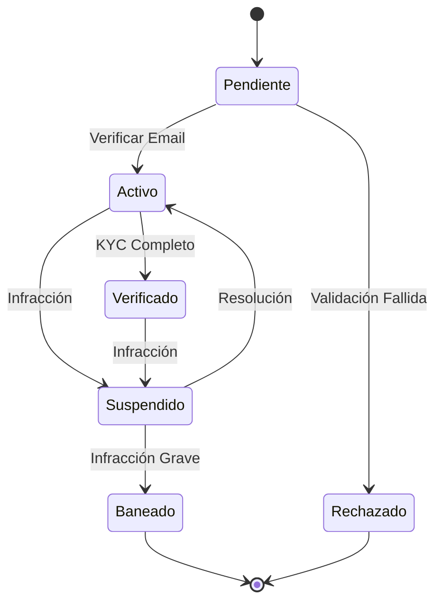

# 👤 Estados de Usuario

## 📊 Diagrama Principal



## 🔄 Estados y Transiciones

### 📝 Pendiente
- **Entrada**: Registro inicial
- **Validaciones**:
  - Email válido
  - Contraseña segura
  - Datos básicos completos
  - No duplicado
- **Salidas**:
  - → Activo (email verificado)
  - → Rechazado (validación fallida)

### ✅ Activo
- **Entrada**: Email verificado
- **Validaciones**:
  - Sesión válida
  - Sin infracciones
  - Actividad normal
  - Límites básicos
- **Salidas**:
  - → Verificado (KYC completo)
  - → Suspendido (infracción)

### 🌟 Verificado
- **Entrada**: KYC completado
- **Validaciones**:
  - Documentos válidos
  - Verificación identidad
  - Dirección confirmada
  - Historial limpio
- **Salidas**:
  - → Suspendido (infracción)

### ⏸️ Suspendido
- **Entrada**: Infracción detectada
- **Validaciones**:
  - Tipo infracción
  - Historial previo
  - Tiempo suspensión
  - Plan resolución
- **Salidas**:
  - → Activo (resolución)
  - → Baneado (infracción grave)

### 🚫 Baneado
- **Entrada**: Infracción grave
- **Validaciones**:
  - Evidencia clara
  - Revisión admin
  - Documentación
  - Notificación legal
- **Acciones**:
  - Cerrar subastas
  - Cancelar transacciones
  - Notificar contactos
  - Registrar motivo

### ❌ Rechazado
- **Entrada**: No cumple requisitos
- **Validaciones**:
  - Motivo rechazo
  - Documentación
  - Posible apelación
- **Acciones**:
  - Notificar razones
  - Limpiar datos
  - Registrar decisión

## 🎯 Acciones por Estado

### Permitidas por Estado
```typescript
interface UserStateActions {
    Pendiente: [
        'verificarEmail',
        'completarPerfil',
        'reenviarVerificacion'
    ];
    
    Activo: [
        'participarSubasta',
        'realizarPuja',
        'iniciarKYC',
        'configurarPerfil'
    ];
    
    Verificado: [
        'crearSubasta',
        'realizarRetiro',
        'accesoPremium',
        'invitarUsuarios'
    ];
    
    Suspendido: [
        'verEstado',
        'contactarSoporte',
        'apelar',
        'resolverProblema'
    ];
}
```

## 🔒 Permisos por Estado

### Matriz de Permisos
```typescript
interface StatePermissions {
    Pendiente: {
        pujar: false,
        crearSubasta: false,
        comentar: false,
        retirar: false
    };
    
    Activo: {
        pujar: true,
        crearSubasta: false,
        comentar: true,
        retirar: limitado
    };
    
    Verificado: {
        pujar: true,
        crearSubasta: true,
        comentar: true,
        retirar: true
    };
    
    Suspendido: {
        pujar: false,
        crearSubasta: false,
        comentar: false,
        retirar: pendiente
    };
}
```

## ⏱️ Timeouts y Límites

### Por Estado
```typescript
interface StateTimeouts {
    Pendiente: {
        verificacionEmail: '24 horas',
        completarPerfil: '7 días'
    };
    
    Activo: {
        completarKYC: '30 días',
        inactividadMaxima: '90 días'
    };
    
    Suspendido: {
        minimaSuspension: '24 horas',
        maximaSuspension: '30 días',
        tiempoApelacion: '7 días'
    };
}
```

## 📱 Notificaciones

### Eventos Notificables
```typescript
interface StateNotifications {
    Pendiente: [
        'bienvenida',
        'recordatorioVerificacion',
        'completarPerfil'
    ];
    
    Activo: [
        'recordatorioKYC',
        'limitesOperacion',
        'recomendaciones'
    ];
    
    Verificado: [
        'confirmacionKYC',
        'nuevosPrivilegios',
        'oportunidades'
    ];
    
    Suspendido: [
        'notificacionSuspension',
        'pasosSiguientes',
        'actualizacionEstado'
    ];
}
```

## 📊 Métricas y KPIs

### Por Estado
```typescript
interface StateMetrics {
    Activo: {
        tasaConversion: number;
        tiempoPromedioPuja: number;
        participacionSubastas: number;
    };
    
    Verificado: {
        volumenTransacciones: number;
        tasaExito: number;
        valoracionPromedio: number;
    };
    
    Suspendido: {
        tasaReincidencia: number;
        tiempoResolucion: number;
        efectividadApelacion: number;
    };
}
```

## 🔍 Queries Comunes

### Por Estado
```typescript
interface StateQueries {
    Pendiente: [
        'pendientesVerificacion',
        'expiranHoy',
        'conversionRate'
    ];
    
    Activo: [
        'sinKYC',
        'altaActividad',
        'riesgoSuspension'
    ];
    
    Verificado: [
        'mejoresVendedores',
        'masActivos',
        'mayorVolumen'
    ];
    
    Suspendido: [
        'proximosReactivar',
        'apelacionesPendientes',
        'reincidentes'
    ];
}
```
